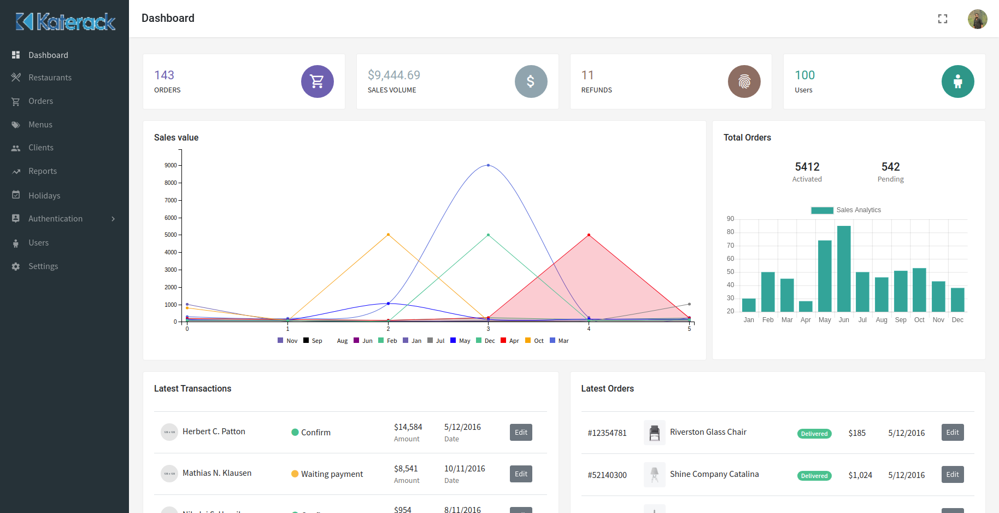
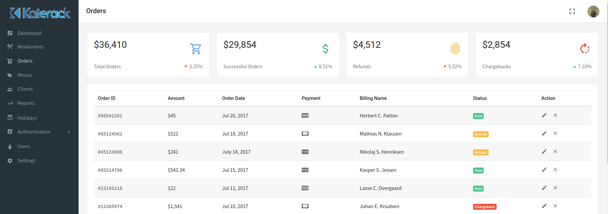

## Demo Link : https://monim143.github.io/react-admin-katerack/

  <h1>React Admin Katerack</h1>

  <strong>Responsive Flat Admin Dashboard</strong>

  A headless, mobile responsive platform delivering ultra-fast, dynamic, personalized experiences. Beautiful admin dashboard, anywhere, on any device.

 

## Table of Contents

- [What makes Katerack special?](#what-makes-Katerack-special)
- [Features](#features)
- [Installation](#installation)
- [Documentation](#documentation)
- [Demo](#demo)
- [Contributing](#contributing)
- [Translations](#translations)
- [Your feedback](#your-feedback)
- [License](#license)

## What makes Katerack special?

Katerack is a Responsive Flat Admin Dashboard and written with React and SASS.

## Features

- Responsive layout (desktops, tablets, mobile devices)
- Built with Bootstrap v4.3.1
- Clean and Flat design
- React with Redux version
- HTML5 & CSS3
- SASS Support
- eCommerce Pages Included
- Login, register pages
- Calendar view
- Vertical Layout
- Orders
- Clients
- Reports
- Users
- Settings

Katerack is free and always will be.
Help us out… If you love free stuff and great software, give us a star! 🌟

## Installation
This project was bootstrapped with [Create React App](https://github.com/facebook/create-react-app).

## Available Scripts

In the project directory, you can run:

### `npm start`

Runs the app in the development mode. 
Open [http://localhost:3000](http://localhost:3000) to view it in the browser.

The page will reload if you make edits. 
You will also see any lint errors in the console.

### `npm test`

Launches the test runner in the interactive watch mode. 
See the section about [running tests](https://facebook.github.io/create-react-app/docs/running-tests) for more information.

### `npm run build`

Builds the app for production to the `build` folder. 
It correctly bundles React in production mode and optimizes the build for the best performance.

The build is minified and the filenames include the hashes. 
Your app is ready to be deployed!

See the section about [deployment](https://facebook.github.io/create-react-app/docs/deployment) for more information.

### `npm run eject`

**Note: this is a one-way operation. Once you `eject`, you can’t go back!**

If you aren’t satisfied with the build tool and configuration choices, you can `eject` at any time. This command will remove the single build dependency from your project.

Instead, it will copy all the configuration files and the transitive dependencies (Webpack, Babel, ESLint, etc) right into your project so you have full control over them. All of the commands except `eject` will still work, but they will point to the copied scripts so you can tweak them. At this point you’re on your own.

You don’t have to ever use `eject`. The curated feature set is suitable for small and middle deployments, and you shouldn’t feel obligated to use this feature. However we understand that this tool wouldn’t be useful if you couldn’t customize it when you are ready for it.

## Learn More

You can learn more in the [Create React App documentation](https://facebook.github.io/create-react-app/docs/getting-started).

To learn React, check out the [React documentation](https://reactjs.org/).

### Code Splitting

This section has moved here: https://facebook.github.io/create-react-app/docs/code-splitting

### Analyzing the Bundle Size

This section has moved here: https://facebook.github.io/create-react-app/docs/analyzing-the-bundle-size

### Making a Progressive Web App

This section has moved here: https://facebook.github.io/create-react-app/docs/making-a-progressive-web-app

### Advanced Configuration

This section has moved here: https://facebook.github.io/create-react-app/docs/advanced-configuration

### Deployment

This section has moved here: https://facebook.github.io/create-react-app/docs/deployment

### `npm run build` fails to minify

This section has moved here: https://facebook.github.io/create-react-app/docs/troubleshooting#npm-run-build-fails-to-minify

## Documentation

Katerack documentation is available here: (https://facebook.github.io/create-react-app/docs/deployment)

To contribute, please see the (https://monim143.github.io/).

## Katerack

For PWA, single-page storefront go to the (https://github.com/monim143/react-admin-katerack) repository.

(https://monim143.github.io/react-admin-katerack)

## Dashboard

For dashboard go to the (https://monim143.github.io/react-admin-katerack) repository.

(https://github.com/monim143/react-admin-katerack)

## Demo

Want to see Katerack in action?

(https://github.com/monim143/react-admin-katerack)

## Contributing

We love your contributions and do our best to provide you with mentorship and support. If you are looking for an issue to tackle, take a look at issues labeled [`Help Wanted`](https://github.com/monim143/react-admin-katerack).

If nothing grabs your attention, check [our roadmap](https://github.com/monim143/react-admin-katerack) or come up with your feature. Just drop us a line or [open an issue](https://github.com/monim143/react-admin-katerack/issues/new) and we’ll work out how to handle it.

Get more details in our [Contributing Guide](https://github.com/monim143).

## Your feedback

Do you use Katerack as admin platform?
Fill out this short survey and help us grow. It will take just a minute, but mean a lot!

[Take a survey](https://github.com/monim143/react-admin-katerack)

## License

Disclaimer: Everything you see here is open and free to use as long as you comply with the [license](https://github.com/monim143/react-admin-katerack/blob/master/LICENSE). There are no hidden charges. We promise to do our best to fix bugs and improve the code.

Some situations do call for extra code; we can cover exotic use cases or build you a custom e-commerce appliance.

#### Crafted with ❤️ by (https://github.com/monim143)

ma.monim35@gmail.com
